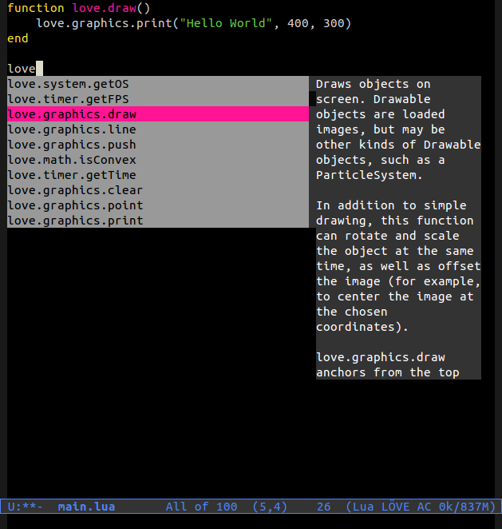

Perform auto-completion on Lua files using the LÖVE framework inside
Emacs using the auto-complete library.

# Installation #

To install add the file `auto-complete-love.el` in your load-path and
then add the following to your .emacs:

    (require 'auto-complete-love)
    (add-hook 'lua-mode-hook '(lambda ()
                                 (setq ac-sources '(ac-source-love))
                                 ; Uncomment only if you're using
                                 ; `auto-complete-lua' (see below)
                                 ;(push ac-source-lua ac-sources)
                                 (auto-complete-mode)))
 

# Screenshot #

# Useful libraries #

## love-minor-mode ##

The `love-minor-mode` library will help you browse the LÖVE
documentation and create new LÖVE projects.

Install it from [this repository](https://github.com/ejmr/love-minor-mode)

## Auto Complete builtin Lua functions ##

You may also like to have auto-complete for the built-in Lua
functions. If so, please install the `auto-complete-lua` from
[this repository](https://github.com/rolpereira/auto-complete-lua.el).

# License #

[GNU General Public License 3](http://www.gnu.org/copyleft/gpl.html)
